## Component Selection:

## Flight Control

**STM32H743VIT6**

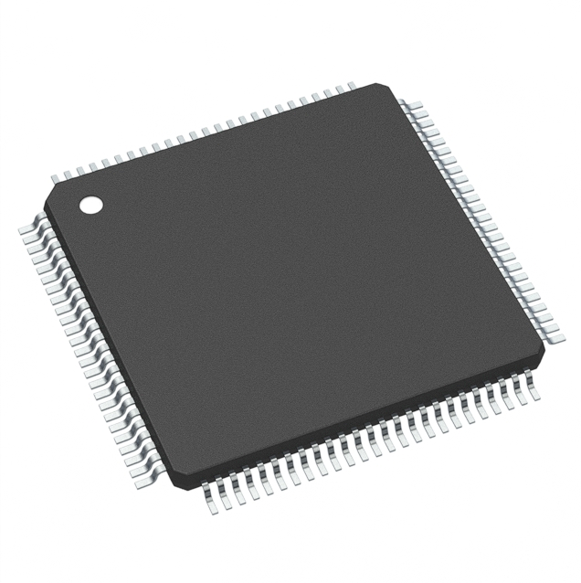

**Rational:**

---

**TDK InvenSense ICM-42688-P**

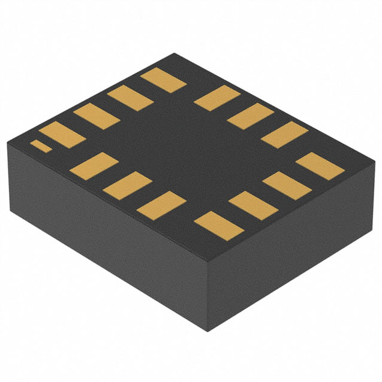

**Rational:**

---

**iST8310**

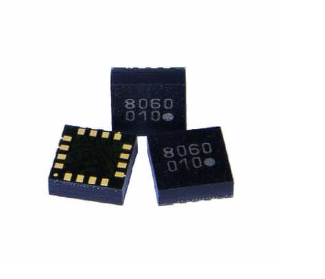

**Rational:**

---

**MS561101BA03-50**

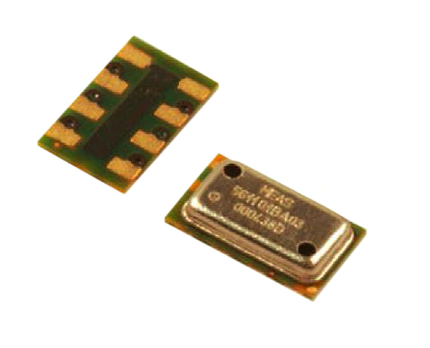

**Rational:**

---

## Propulsion and Power

**EMAX RS2814 KV730**

**Rational:**

---

**Tattu 14.8V 25C 4S 10000mAh Lipo Battery**

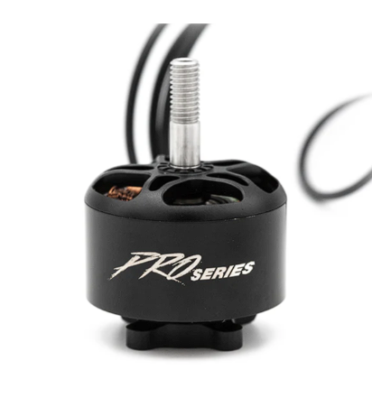

**Rational:**

---

**30A 4-in-1 Brushless ESC**

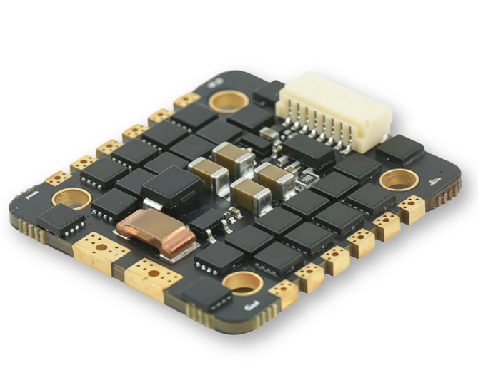

**Rational:**

---

**Matek XCLASS PDB FCHUB V2 PDB 12S**

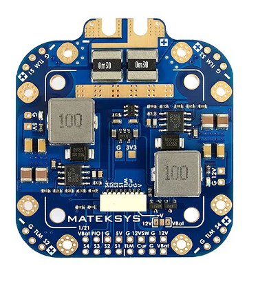

**Rational:**

---

## Communications

**NRF24L01+PA+LNA**

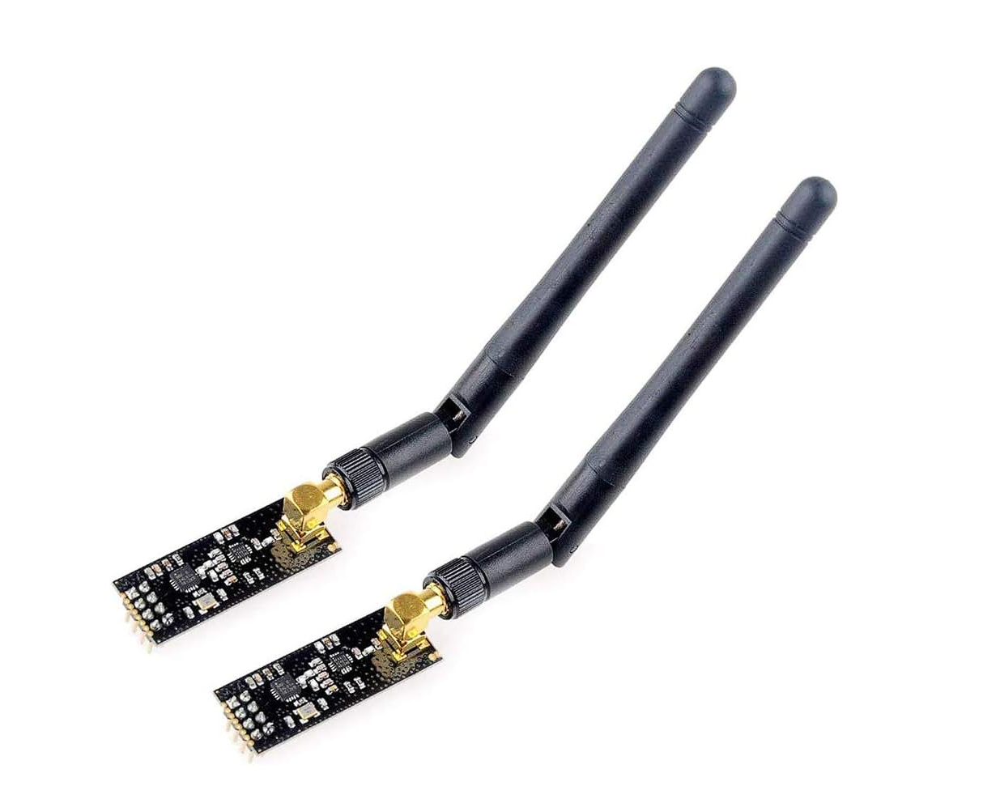

**Rational:**

---

## Sensors

**BN-880 GPS + compass**

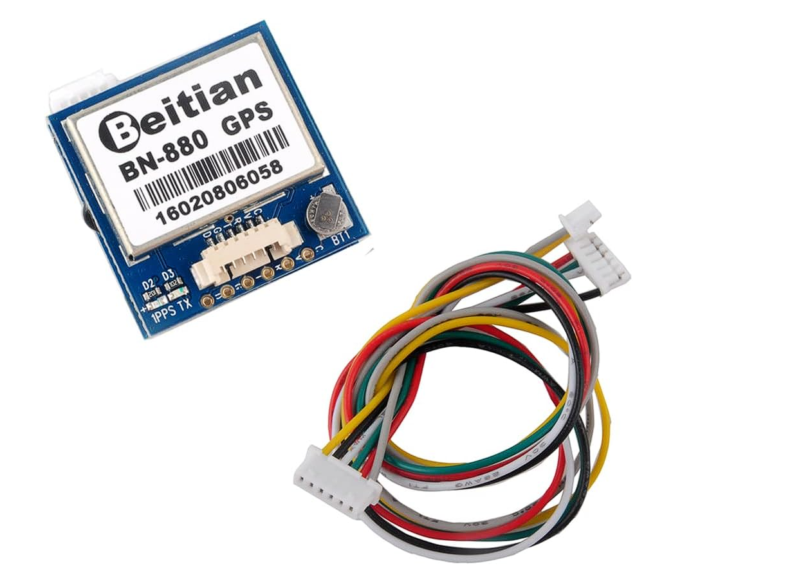

**Rational:**

---

**TSYS01 temperature sensor**

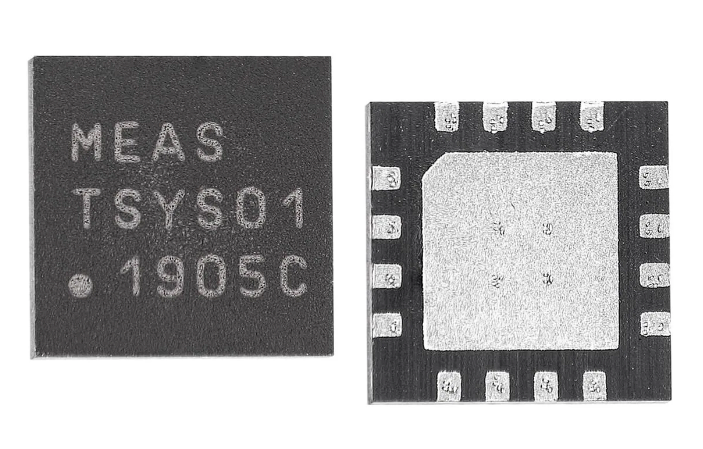

**Rational:**

---

## Controller PCB + display

**SSD1306 OLED 0.96"**

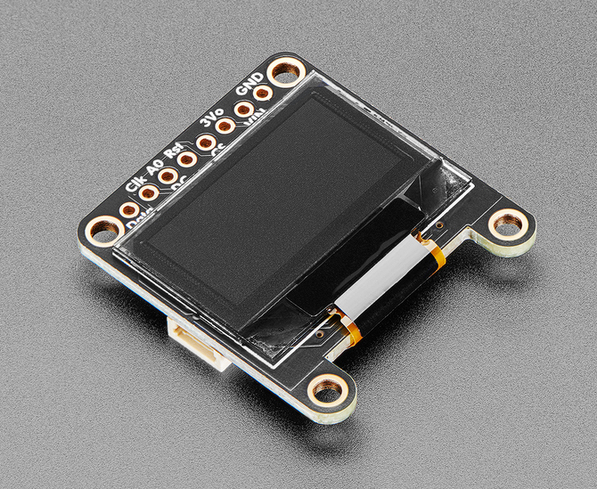

**Rational:**

---

**STM32F405RGT6**

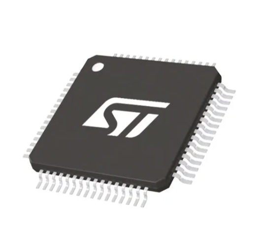

**Rational:**

---

**Hall effect joystick gimbals**

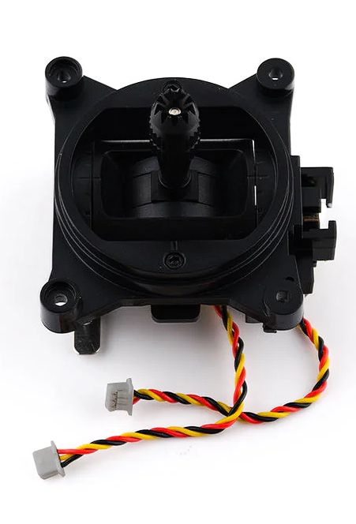

**Rational:**

---

**MAX17048 fuel gauge**

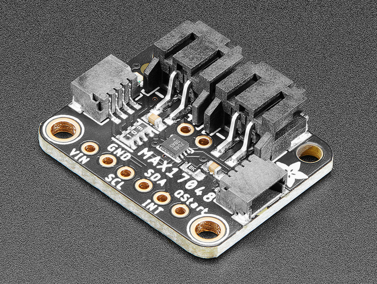

**Rational:**

---

**2S LiPo 2000mAh**

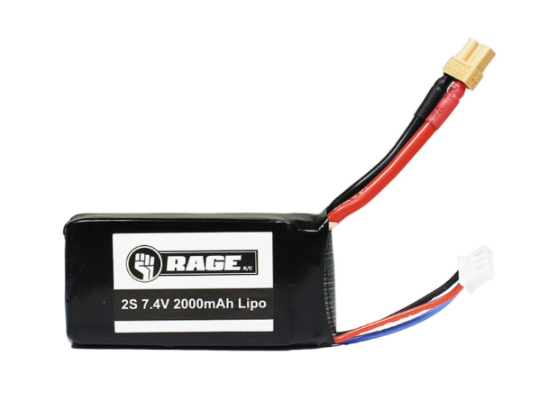

**Rational:**

---

**TP4056 BMS**

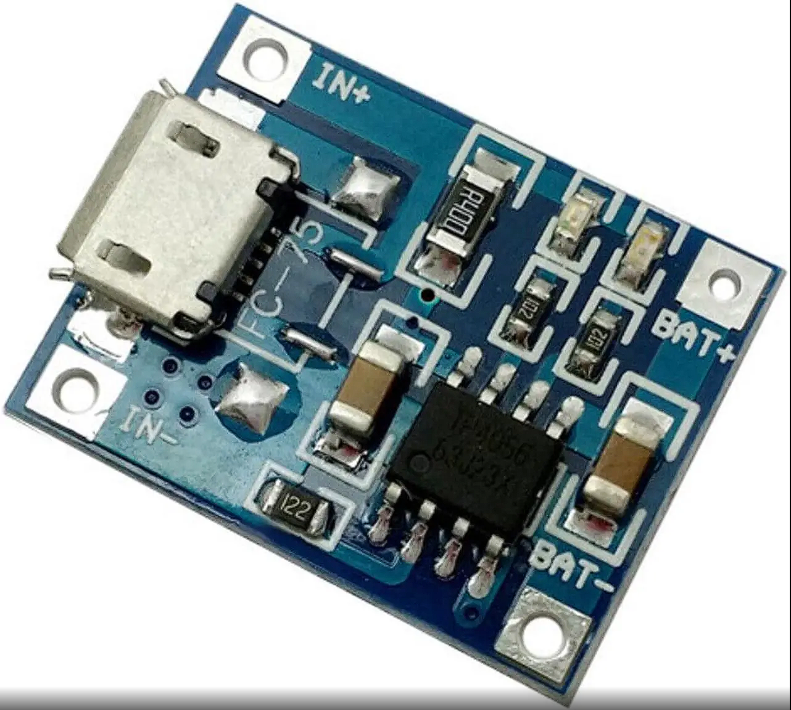

**Rational:**

